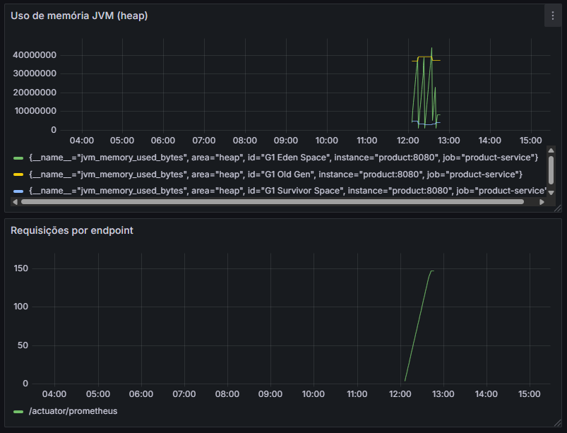

# Bottlenecks Implementados

## 1. Caching com Redis

Aplicado no `product-service` para cachear chamadas `GET /product/{id}`.

- Reduz requisições ao banco
- Ganha de performance em leitura
- Implementado com `@Cacheable`

## 2. Observability com Prometheus + Grafana

Coletando métricas de:

- Uso de memória JVM
- Total de requisições

### Dashboard no Grafana com as métricas

