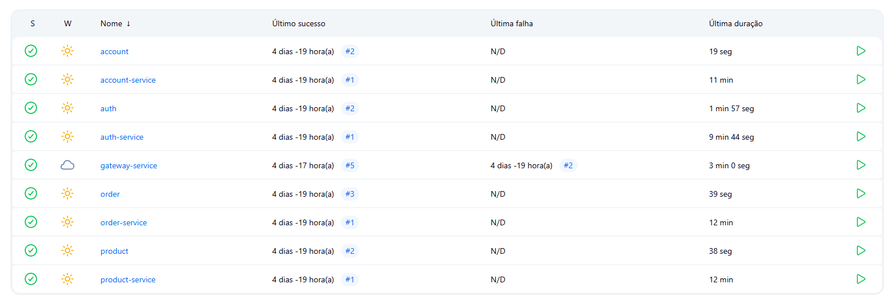

# Jenkins e CI/CD

Cada microsserviço possui seu `Jenkinsfile` com as etapas de:

- Build com Maven
- Docker build + tag
- Push para repositório de imagens (Docker Hub)
- Deploy via Minikube (futuramente)

---

## Pipeline exemplo

```groovy
pipeline {
  agent any
  stages {
    stage('Build') {
      steps {
        sh './mvnw clean package'
      }
    }
    stage('Docker') {
      steps {
        sh 'docker build -t user/product-service .'
      }
    }
  }
}
```
### Jenkins funcionando

