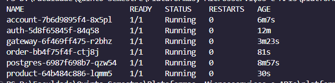

# Deploy com Minikube

Este projeto também foi testado em ambiente local com Kubernetes usando o Minikube.

## Comandos utilizados

```bash
minikube start
kubectl apply -f k8s/k8s.yaml
kubectl get pods
```

### Minikube funcionando

